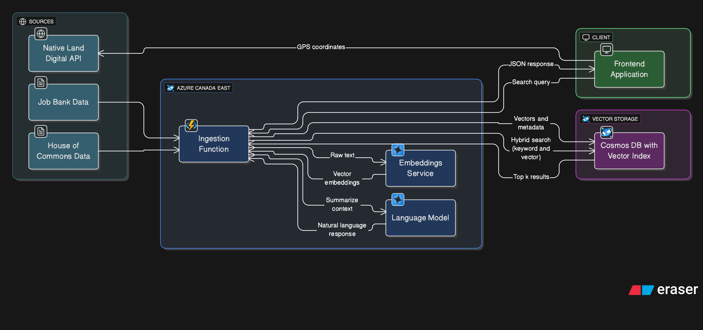

# System Architecture

## Data Ingestion & Processing Pipeline

The following diagram illustrates the flow of unstructured data (Jobs & Transcripts) into the unified Vector Search index.

### Data Sovereignty & Hybrid Residency Strategy

To balance the **Rapid Solution Lab (RSL)** timeline with strict government data residency requirements (e.g., Protected B), Canada Works implements a **Split-Stack Architecture**. This modular design allows the "Compute" and "Storage" layers to be decoupled based on regional availability.

#### **1. Prototype Configuration (Current State)**
For this demonstration, I utilized a hybrid model to maximize development velocity:
* **Compute & AI (🇨🇦 Canada East):** All Application Logic (Azure Functions) and Cognitive Processing (Azure OpenAI GPT-4o) occur strictly within Canadian data centers. Raw text and user queries never leave Canadian jurisdiction during processing.
* **Vector Indexing (🇺🇸 US East):** Due to the current preview status of integrated Vector Search in Canadian regions, the *mathematical vector embeddings* are stored in the US.
    * *Data Minimization:* Only the vector arrays (`float[]`)—which are cryptographically irreversible without the source text—are transmitted for similarity ranking.

#### **2. Production & Open Source Sovereignty Path**
This architecture is designed to be **Region Agnostic**. The Vector Search module is loosely coupled and can be swapped for **Open Source** or **Sovereign Cloud** alternatives to meet the specific legal requirements of any G7 nation:
* **Open Source Self-Hosted:** For complete isolation, the vector engine can be replaced with containerized open-source solutions like **Qdrant**, **Weaviate**, or **pgvector (PostgreSQL)**. These can be deployed on Kubernetes clusters within *any* specific jurisdiction (e.g., on-premise government servers or private cloud).
* **G7 Regional Scalability:** This pattern ensures the solution can be deployed locally in other G7 partner nations using their respective sovereign cloud regions:
    * **🇫🇷 France:** Azure France Central (Paris)
    * **🇬🇧 UK:** Azure UK South (London)
    * **🇯🇵 Japan:** Azure Japan East (Tokyo)
    * **🇩🇪 Germany:** Azure Germany West Central (Frankfurt)

---

### Future State: Enterprise Hardening

To transition from "RSL Prototype" to "Production Government Service," the roadmap includes the integration of advanced security and safety layers.

#### **3. Responsible AI & Content Moderation**
To ensure the system remains safe for public use and free from bias or jailbreak attempts, the architecture will integrate **Azure AI Content Safety**.
* **Input Guardrails:** All user queries will be scanned for hate, violence, self-harm, and sexual content before reaching the LLM.
* **Output Filtering:** Generated summaries will be real-time monitored to prevent "hallucinations" or policy violations before being displayed to the user.
* **Jailbreak Detection:** Advanced detection logic to prevent users from manipulating the system prompt.

#### **4. Governance & Access Control (APIM)**
To support **Interoperability** across different ministries and third-party developers, the backend APIs will be placed behind **Azure API Management (APIM)**.
* **Unified Front Door:** APIM will act as the single entry point, abstracting the backend Azure Functions from the public internet.
* **Throttling & Rate Limiting:** Prevents DDoS attacks and manages cost by enforcing quota limits per user/ministry.
* **OIDC Authentication:** Integration with government identity providers (e.g., GCKey, Microsoft Entra ID) to ensure only authorized personnel can access the "Analyst View" or Legislative data tools.
