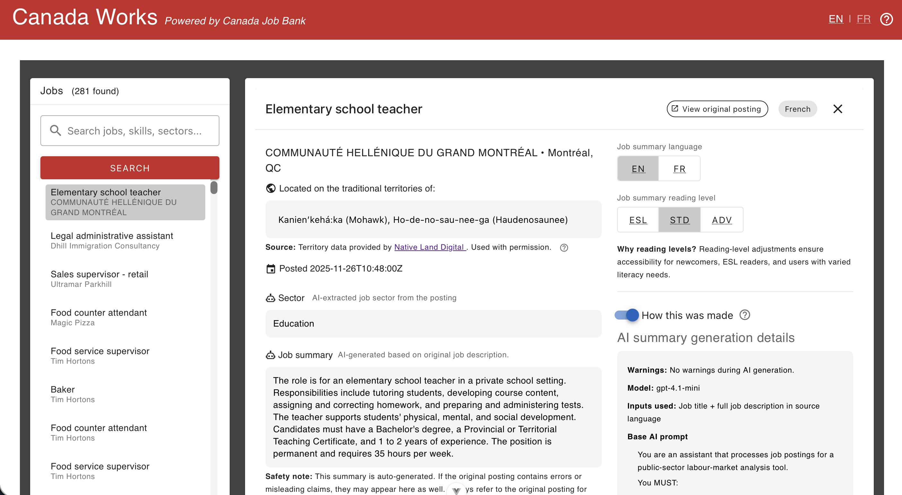
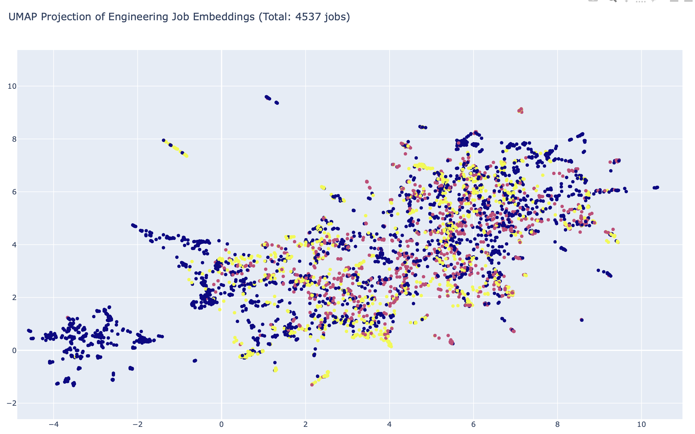

# Canada Works 🇨🇦
> **Bridging the gap between Legislative Intent and Public Service Action.**

### G7 GovAI Grand Challenge Submission (Rapid Solution Lab)

**Canada Works** is an AI-powered labour market intelligence platform. It transforms disconnected government datasets—Job Bank postings, Parliamentary Committee transcripts, and Indigenous Territory data—into a unified, context-aware interface for job seekers and policy analysts. For this Rapid Solution Lab, we chose to link Executive Data (Jobs) with Legislative Data (Debates). While this is just one example of cross-ministry interoperability, it demonstrates the platform's ability to shatter data silos. This same vector engine can be scaled to connect any disconnected government datasets without changing the code.

---

## The Problem: Data Silos
Government information operates in disconnected silos:
1.  **The Public Service** facilitates employment (Job Bank / ESDC).
2.  **Parliament** debates and funds mandates (House of Commons).
3.  **The Land** holds the history and context (Indigenous Territories).

**The Gap:** A citizen applying for an "Environmental Engineer" role sees a job description but has no visibility into the Parliamentary debate that funded the position, nor the Indigenous territory where the work occurs.

## The Solution
**Canada Works** uses a serverless Azure architecture to create a "Civic Graph" that connects these silos:

* **Hyper-Accessibility:** Instantly generates job summaries at three distinct literacy levels (ESL Level 5, Standard Level 8, Advanced Policy).
* **Legislative Interoperability:** Uses Vector Search to link job descriptions to specific *House of Commons Committee Evidence* (e.g., matching a "Water Quality" job to an ENVI Committee debate on freshwater protection).
* **Contextual Awareness:** Integrates *Native Land Digital* APIs to strictly visualize Traditional Indigenous Territories, challenging the "invisible land" problem in standard economic data.

---

## Technical Innovation: The "Semantic Island"
Beyond simple keyword matching, Canada Works uses high-dimensional vector analysis to map the topology of the labour market.

**Figure 1: UMAP Vector Projection (4,500+ Jobs)**
**Example Discovery:** We identified a distinct "Semantic Island" (Coordinate 8, -1) of Indigenous-focused roles. These positions are often invisible to standard keyword search due to distinct vocabulary. Our vector engine ensures these opportunities remain visible.

---

## Tech Stack & Data Sovereignty

### Architecture
* **Frontend:** Vue.js 3 (Compliant with Government of Canada Web Experience Toolkit standards).
* **Compute:** Azure Functions (Serverless) - *Hosted in Canada East 🇨🇦*
* **AI Logic:** Azure OpenAI Service (GPT-4o) - *Hosted in Canada East 🇨🇦*
* **Database:** Azure Cosmos DB (NoSQL + Integrated Vector Search).

### Hybrid Data Residency Strategy
To balance rapid prototyping speed with **Protected B** data requirements, we implemented a privacy-first hybrid model:
1.  **Compute in Canada:** All Generative AI processing and raw text handling occur strictly within Canadian jurisdiction.
2.  **Math in the US (Prototype):** For this RSL demo, we utilize Azure's integrated Vector Search in the US.
3.  **Data Minimization:** Only mathematical vector embeddings (cryptographically irreversible without source text) are transmitted for indexing. No PII is stored in the vector index.
4.  **Production Roadmap:** The architecture is designed to swap the vector module for a Canadian-hosted container (e.g., Qdrant on AKS) immediately upon production deployment.

---

## 👨‍💻 About the Architect

**Joe Radman** | *Independent Innovator*

I am an Enterprise Systems Architect with over 15 years of experience in the Canadian higher education sector.
* **Background:** Currently leading AI integration projects at a major Canadian university.
* **Proven Scale:** I am the lead architect behind **JADA**, a student-facing AI career assistant recently featured by [Microsoft Source](https://news.microsoft.com/source/canada/2025/03/04/meet-jada-the-ai-assistant-expanding-job-opportunities-for-university-of-waterloo-students/) (March 2025). The architecture used in **Canada Works** is an evolution of that production system, adapted specifically to address G7 public sector challenges.
* **Mission:** To demonstrate how "Enterprise Patterns" can be applied to open government data to solve interoperability and accessibility challenges at scale.

---

## License & Attribution
* **Code:** MIT License.
* **Open Data:** Employment and Social Development Canada (Job Bank), House of Commons (Open Data), Native Land Digital.
* **Creator:** Joe Radman, Independent Innovator.
